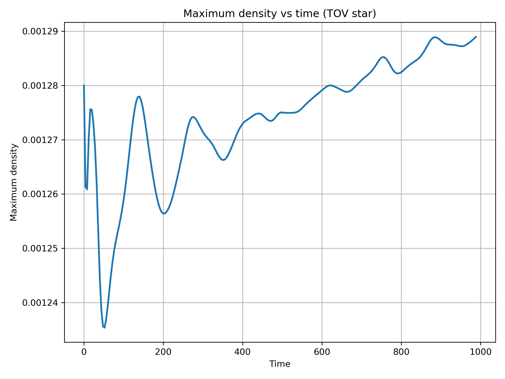

# Evolution of a TOV Star using Einstein Toolkit

This project presents the numerical evolution of a Tolman–Oppenheimer–Volkoff (TOV) star using the Einstein Toolkit.

## Tools used

- Einstein Toolkit
- GRHydro
- ML_BSSN
- TOVSolver
- Python
- NumPy
- Matplotlib

## Objective

Study the stability of a relativistic neutron star by analyzing the evolution of its maximum density.

## Results

The maximum density remains nearly constant during the evolution, indicating a stable TOV configuration.

## Author

Cynthia Maldonado González  
M.Sc. Physics, UNAM
